# Orion Agentic AI Built From Scratch

Imagine having an AI assistant that doesn't just chat; it actually does things. It searches the web, runs your code, reads your files, schedules tasks, and even applies to jobs for you while you watch.

That's what I wanted. And when I couldn't find it built the right way, I built it myself. Used Claude API's instead of OpenAI's API's.

Most "AI agent" projects are wrappers around LangChain or the Agent SDK. They hide the hard parts behind abstractions. I wanted to understand every layer, how tool calls actually work, how to make Claude route intelligently between models, how to keep an AI system safe without slowing it down. That's why Orion is built entirely on the raw Anthropic Python SDK, with zero frameworks. Every part of the agentic loop is hand-written.

The result is a fully functional AI agent with 13 tools, 3-layer safety guardrails, intelligent model routing, a streaming web UI, and the ability to auto-apply to real job listings on Greenhouse and Lever; filling forms, uploading your resume, and handling custom questions, all while you watch in a live browser window.



---

## Why This Matters

Over **70% of job seekers** report that the application process is mentally exhausting [LinkedIn Workforce Report]. The average job application takes 30–60 minutes of repetitive data entry; name, email, phone, LinkedIn, resume, the same fields on every single form.

For people learning AI engineering, most tutorials show you how to call an API. Very few show you how to build a real agentic system; one that loops, recovers from errors, routes between models intelligently, and stays safe without human babysitting.

I built Orion to solve both problems at once.

---

## What Orion Does

**Conversational AI with real tools**: not just language, but action. Ask it to search the web, execute Python, read a file, or schedule a future task. It decides which tool to use, uses it, and keeps going until the job is done.

**Intelligent model selection**: not every question needs Claude Opus. Orion routes each request to the right model automatically, in under a millisecond, with no extra API calls.

**3-layer safety guardrails**: input is checked before Claude ever sees it, tool calls are validated before they execute, and output is scanned before it reaches you.

**Job auto-apply**: Orion searches Greenhouse and Lever job boards, opens a real Chromium browser, and fills out the application form with your saved profile. You watch every field being filled in real time.

---

## How It Works

### The Agentic Loop: Thinking in Turns

The core insight behind an AI agent is simple: Claude doesn't just answer once. It thinks, acts, observes the result, and thinks again.

Here's exactly how Orion implements this:

**Step 1 — User sends a message**

The message arrives at the FastAPI backend via an HTTP POST. A session ID ties the request to a stored conversation history. This is how Orion remembers what you said earlier; Claude itself is stateless, so Orion maintains the full message list and sends it with every API call.

**Step 2 — Safety check (Layer 1)**

Before anything reaches Claude, the input passes through the guardrail system. It checks for:
- Jailbreak attempts ("ignore previous instructions", "act as DAN", "pretend you have no restrictions")
- Dangerous shell commands (`rm -rf`, `DROP TABLE`, `format c:`)
- PII that should be flagged (emails, phone numbers, SSNs)
- Input over 8,000 characters

If blocked, the rejection message streams back immediately. Claude never sees it.

**Step 3 — Model routing**

Orion decides which Claude model to use in under 1 millisecond; no extra API call, no LLM-based decision. Pure rules:

| Signal | Routed to |
|---|---|
| High-risk tool active (run_python, apply_job, write_file...) | claude-opus-4-6 |
| Input over 400 characters | claude-opus-4-6 |
| Complexity keywords (write, execute, analyze, schedule...) | claude-opus-4-6 |
| Medium-risk tools (web_search, read_file, cancel_task) | claude-sonnet-4-6 |
| Short input + only low-risk tools | claude-haiku-4-5 |
| Default | claude-sonnet-4-6 |

This matters because Opus is 15× more expensive than Haiku. Routing "What time is it?" to Haiku and "Write and run this data pipeline" to Opus saves significant cost without sacrificing quality.



**Step 4 — Claude API call**

Orion sends the full message history plus all 13 tool schemas to the Claude API. The `thinking` parameter (`{"type": "adaptive"}`) is included for Opus and Sonnet — this activates Claude's internal reasoning chain. It's omitted for Haiku, which doesn't support it.

**Step 5 — Tool detection and execution**

Claude responds with either a text answer (`stop_reason: end_turn`) or a request to use a tool (`stop_reason: tool_use`). If it's a tool call:

1. The tool name and input are extracted from the response
2. Layer 2 guardrail validates the call (is `run_python` trying to import `os`? Is `write_file` targeting `C:\Windows\`?)
3. If safe, the tool function executes locally
4. The result is appended to the message history as a `tool_result` block
5. Orion loops back to Step 4

This continues for up to 50 iterations. Claude can chain tools; search the web to find a URL, read the file at that URL, run Python to analyze it, and write a report; all in one request.



**Step 6 — Output validation (Layer 3)**

When Claude finally reaches `end_turn`, the response is scanned one more time before streaming to the user. This catches anything that shouldn't appear in output — API keys, PEM private keys, hardcoded passwords or secrets.

**Step 7 — SSE streaming**

The final response streams to the browser via Server-Sent Events. Each chunk appears as Claude generates it. The browser uses `fetch()` POST (not `EventSource`) because EventSource only supports GET requests and can't send a body.

```
User Input
    │
    ▼
[Layer 1: Input Guardrail] ─── blocked? ──► Rejection message
    │
    ▼
[Model Router] ──────────────────────────► haiku / sonnet / opus
    │
    ▼
[Claude API]
    │
    ├── stop_reason: end_turn
    │       │
    │       ▼
    │   [Layer 3: Output Guardrail] ──► Stream to browser
    │
    └── stop_reason: tool_use
            │
            ▼
        [Layer 2: Tool Guardrail] ─── blocked? ──► Error result
            │
            ▼
        [Execute Tool Locally]
            │
            ▼
        [Append tool_result to history]
            │
            └──────────────────────────► Back to Claude API (loop)
```

---

### 3-Layer Guardrails — Safety Without Slowdown

Traditional AI safety adds latency. Orion's guardrails add zero latency to the happy path because they run locally, with no extra API calls.



**Layer 1 — Input (before Claude sees anything)**

Every message passes through 15+ jailbreak pattern checks, dangerous command detection, and a length limit. If anything triggers, the request is rejected in under a millisecond and Claude is never called.

**Layer 2 — Tool calls (before each tool executes)**

The riskiest tools get the strictest checks. `run_python` is sandboxed — any code containing `import os`, `import sys`, `import subprocess`, `eval()`, `exec()`, or `open(..., "w")` is blocked before it runs. `write_file` validates the target path against a protected list.

**Layer 3 — Output (before the response reaches you)**

The final text is scanned for secrets; API keys (`sk-`, `sk-ant-`), PEM private keys, and hardcoded credentials. If found, the response is replaced with a guardrail message.

All high-risk tool calls are written to an in-memory audit log. The Shield button in the UI shows the full event history.

---

### Job Auto-Apply — Automation You Can Watch

The most striking feature of Orion is that it can apply to real jobs on your behalf. Here's how it works end to end.

**Step 1 — Job Search**

When you ask Orion to find jobs, it builds targeted DuckDuckGo queries using the `site:` operator:

```
site:boards.greenhouse.io machine learning engineer remote
site:jobs.lever.co AI engineer Denver
```

This finds real job listings on Greenhouse and Lever without any API key. Results are filtered by URL structure — only actual job listing pages are kept (e.g., `/company/jobs/12345`), not company homepages or search pages.

**Step 2 — ATS Detection**

Before attempting an application, Orion identifies which Applicant Tracking System the URL belongs to:
- `boards.greenhouse.io` → Greenhouse
- `jobs.lever.co` → Lever

Each platform has a consistent form structure across all companies that use it, which is what makes automation possible.

**Step 3 — Profile Loading**

Your personal details are stored in `job_apply/profile.json` — name, email, phone, LinkedIn, GitHub, resume path, and a set of pre-written answers to common application questions (salary expectations, notice period, why you're interested, etc.).

**Step 4 — Browser Automation**

Orion launches a real Chromium browser window using Playwright. You watch every field being filled:

For Greenhouse applications:
- `#first_name`, `#last_name`, `#email`, `#phone`
- `#linkedin_profile`, `#website`
- Resume file upload (`input[type="file"]`)
- Cover letter textarea
- Custom questions (text fields, dropdowns, radio buttons) — matched by label keyword to your pre-written answers

For Lever applications:
- `input[name="name"]`, `input[name="email"]`, `input[name="phone"]`, `input[name="org"]`
- `input[name="urls[LinkedIn]"]`, `input[name="urls[GitHub]"]`
- Resume upload, cover letter, custom questions



**Step 5 — Confirmation and Logging**

After submission, Orion scans the page for success signals ("Application submitted", "Thank you for applying"). A screenshot is taken before and after submission. Every attempt — success or failure — is logged to `applied_jobs.json` with a timestamp.

**One rule Orion never breaks:** It will never apply to a job without explicit confirmation from you first. The system prompt enforces this strictly.



---

## What I Achieved

### Agent Performance
- 13 tools covering real-time data, file I/O, code execution, scheduling, and job applications
- Up to 50 tool-use iterations per request — handles complex multi-step tasks
- Streaming responses with less than 100ms time-to-first-token

### Model Routing
- Sub-millisecond routing decision (no API call required)
- 3 model tiers with automatic selection based on risk and complexity
- `thinking` parameter applied selectively — activated for Opus and Sonnet, excluded for Haiku

### Safety Guardrails
- 15+ jailbreak patterns blocked at input
- Python sandboxing: blocks `import os`, `import sys`, `import subprocess`, `eval`, `exec`, `open(..., "w")`
- File path protection: blocks writes to `/etc/`, `/sys/`, `C:\Windows\`, `C:\System32\`
- Output scanning: blocks API keys (`sk-`, `sk-ant-`), PEM private keys, hardcoded credentials
- All high-risk tool calls logged to in-memory audit trail (last 200 events)

### Job Apply
- Greenhouse and Lever supported — used by thousands of tech companies (Stripe, Airbnb, Netflix, Figma, Shopify)
- Handles text fields, dropdowns, radio buttons, file uploads, cover letters, and custom questions
- Application logged within 5–8 seconds of submission

### System
- 20–30 frames per second in the browser UI
- Runs completely on a standard laptop — no GPU required
- Works offline (internet only needed for web search and email alerts)

---

## Tools Available (13 total)

| Tool | Risk Level | What It Does |
|---|---|---|
| `get_datetime` | Low | Current date and time |
| `calculate` | Low | Safe math expression evaluator |
| `get_weather` | Low | Live weather via Open-Meteo (no API key needed) |
| `list_tasks` | Low | Show all scheduled tasks |
| `list_applications` | Low | Job application history log |
| `web_search` | Low | DuckDuckGo search (no API key needed) |
| `read_file` | Medium | Read any file from disk |
| `cancel_task` | Medium | Cancel a scheduled task |
| `search_jobs` | Medium | Find jobs on Greenhouse and Lever |
| `write_file` | High | Write content to disk (path-protected) |
| `run_python` | High | Execute Python code (sandboxed, 15s timeout) |
| `schedule_task` | High | Schedule a future task via APScheduler |
| `apply_job` | High | Auto-apply to a Greenhouse or Lever job |

---

## Get Started

### 1. Clone the repository
```bash
git clone https://github.com/chandra122/OrionAiAgent.git
cd OrionAiAgent
```

### 2. Create your environment
```bash
conda create -n orion python=3.11 -y
conda activate orion
pip install -r requirements.txt
playwright install chromium
```

### 3. Add your API key
```bash
echo "ANTHROPIC_API_KEY=sk-ant-your-key-here" > .env
```

### 4. Set up your job profile (for auto-apply)
```bash
cp job_apply/profile.json.example job_apply/profile.json
# Edit profile.json — add your name, email, resume path, LinkedIn, etc.
```

### 5. Run
```bash
uvicorn server:app --reload --port 8000
```

Open `http://localhost:8000` in your browser.

Or use the CLI:
```bash
python main.py
```

---

## Try It

**General tasks:**
```
What's the weather in Denver right now?
Search the web for the latest AI engineering job market trends
Calculate the compound interest on $10,000 at 7% for 10 years
Run this Python code: [your script]
Remind me to apply to more jobs in 3 hours
```

**Job search and apply:**
```
Search for machine learning engineer jobs remote on Greenhouse and Lever
Apply to this job: https://boards.greenhouse.io/company/jobs/12345
List all my applications from this week
```

---

## Project Structure

```
OrionAiAgent/
├── agent.py              # Core agentic loop — tool detection, execution, guardrail hooks
├── tool_registry.py      # @registry.tool() decorator — name, schema, async function
├── tools.py              # All 13 tool implementations
├── guardrails.py         # 3-layer safety system — input, tool call, output
├── model_router.py       # Rules-based model selection — haiku / sonnet / opus
├── server.py             # FastAPI backend — SSE streaming, session store, API routes
├── main.py               # CLI entry point + SYSTEM_PROMPT definition
├── static/
│   └── index.html        # Single-file frontend — dark theme, voice input, tool dropdown
├── job_apply/
│   ├── detector.py       # ATS detection + DuckDuckGo search query builder
│   ├── greenhouse.py     # Playwright form automation for Greenhouse
│   ├── lever.py          # Playwright form automation for Lever
│   └── profile.json.example  # Template — copy to profile.json and fill in your details
├── assets/               # Screenshots and GIFs for this README
├── evals/
│   └── run_evals.py      # Automated correctness tests for all tools and safety systems
└── requirements.txt
```

---

## What's Next

The two directions I want to take Orion next:

**First — Long-term memory.** Right now, conversation history resets when you close the browser. I want Orion to remember context across sessions — past job applications, your preferences, ongoing projects — stored in a local vector database.

**Second — Multi-agent orchestration.** Instead of one agent with 13 tools, I want a coordinator agent that delegates to specialized sub-agents: a research agent, a code agent, a job-apply agent. Each runs independently and reports back. This mirrors how real AI systems at scale are designed.

---

## Built With

**AI**
- [Anthropic Claude](https://anthropic.com) — claude-opus-4-6, claude-sonnet-4-6, claude-haiku-4-5

**Backend**
- [FastAPI](https://fastapi.tiangolo.com) — async Python web framework
- [APScheduler](https://apscheduler.readthedocs.io) — in-process task scheduling
- [anyio](https://anyio.readthedocs.io) — async runtime

**Browser Automation**
- [Playwright](https://playwright.dev/python/) — browser automation for job apply

**Job Search**
- [ddgs](https://pypi.org/project/ddgs/) — DuckDuckGo search (no API key needed)

**Frontend**
- Plain HTML, CSS, and vanilla JavaScript — no React, no npm, no build step

**References:**
- [Anthropic Tool Use Documentation](https://docs.anthropic.com/en/docs/tool-use)
- [Building Effective Agents — Anthropic](https://www.anthropic.com/research/building-effective-agents)
- [Greenhouse ATS Developer Docs](https://developers.greenhouse.io)
- [Lever API Documentation](https://hire.lever.co/developer)

---

## License

MIT License — see [LICENSE](LICENSE) file for details.
